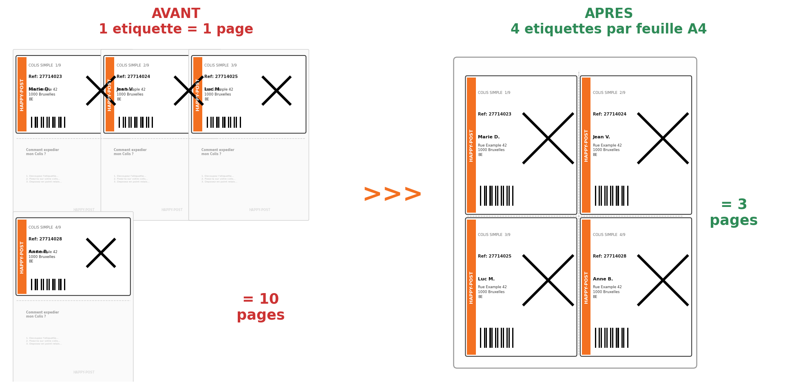

# Happy Post — Reformatage d'étiquettes



## Le problème

Les PDF d'étiquettes générés par [Happy Post](https://happy-post.com) utilisent **une page entière par étiquette** — la moitié haute est l'étiquette de transport, la moitié basse sont des instructions répétées à chaque page.

## La solution

Cet outil extrait uniquement la partie utile et regroupe **4 étiquettes par feuille A4**. Résultat : **~70% de papier économisé**.

## Utilisation

### App web (Streamlit)

```bash
pip install -r requirements.txt
streamlit run app.py
```

Uploadez votre PDF, téléchargez le résultat. C'est tout.

#### Ligne de commande

```bash
python reformat_etiquettes.py <etiquettes_happypost.pdf> [output.pdf]
```

Sans nom de sortie, génère `<nom_original>_4par_page.pdf`.

#### Déploiement Streamlit Cloud

1. Pousser le repo sur GitHub
2. Aller sur [share.streamlit.io](https://share.streamlit.io)
3. Connecter le repo, sélectionner `app.py`
4. L'app est en ligne, partageable par lien

## Dépendances

```bash
pip install -r requirements.txt
```

---

Un outil par [FURGO](https://shop.furgo.fr)
